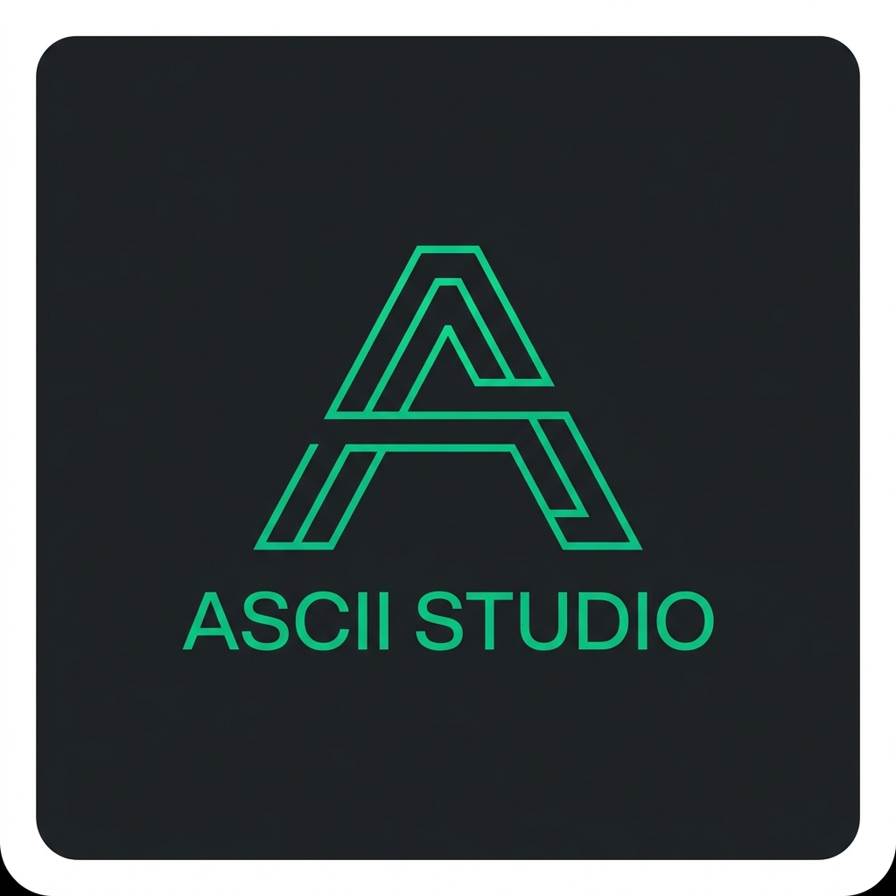

# ASCII Studio

A browser-based tool for converting images, GIFs, and animated WebPs into high-fidelity ASCII art. Zero server dependencies — everything runs locally in the browser using Web Workers and Canvas APIs.



## Features

- **Image to ASCII** — Convert any JPG, PNG, WebP, or GIF into monochrome or full-color ASCII art
- **Animated GIF/WebP Support** — Decode and play back animated ASCII art with frame-by-frame caching
- **Color Modes** — Mono, original color, matrix, amber, cyberpunk, fire, and custom single-color
- **Character Presets** — Classic, dense, braille, binary, block, numeric, symbol, and minimal sets plus custom input
- **Style Presets** — One-click styles (Clean, Portrait, Terminal, Matrix, CRT, Noir, etc.)
- **Live Editing** — Brush, rectangle, circle, line, fill, text, and eraser tools to paint directly on the ASCII grid
- **Layer System** — Multiple layers with visibility and lock controls
- **Comparison Slider** — Side-by-side original vs. processed vs. ASCII with draggable dividers
- **Image Adjustments** — Brightness, contrast, gamma, detail level, rotation, and flip
- **Animation Timeline** — Play, pause, loop, FPS control, and frame scrubbing with pre-buffering
- **Histogram** — Real-time luminance and RGB histogram of the source image
- **Zoom & Pan** — Mouse wheel zoom, two-finger pan, fit-to-view, and reset
- **Export** — TXT, PNG, SVG, HTML, clipboard copy, and full JSON project export
- **Project Save/Load** — Persist and restore projects via local storage
- **Keyboard Shortcuts** — Ctrl+C to copy, C for comparison mode, and more
- **Responsive Design** — Desktop sidebar layout, mobile bottom-sheet inspector and tab bar
- **Shader Background** — Animated WebGL gradient background

## Tech Stack

| Layer | Technology |
|---|---|
| Framework | React 19 |
| Language | TypeScript 6 |
| Build | Vite 8 |
| Styling | Tailwind CSS 4 |
| Linting | OxLint |
| Workers | Web Workers (inline, no external scripts) |
| Rendering | Canvas 2D, WebGL (shader background) |
| Deployment | Vercel (static) |

## Getting Started

### Prerequisites

- Node.js 18+
- npm, pnpm, or yarn

### Install

```bash
git clone <repo-url>
cd ascii_studio
npm install
```

### Development

```bash
npm run dev
```

Opens at `http://localhost:5173`.

### Build

```bash
npm run build
```

Output goes to `dist/`.

### Preview

```bash
npm run preview
```

### Lint

```bash
npm run lint
```

## Project Structure

```
src/
├── components/
│   ├── canvas/          # AsciiCanvas, ComparisonSlider
│   ├── common/          # ShaderBackground, FloatingZoom, ExportDialog
│   ├── editor/          # Brush/shape cell logic
│   ├── layout/          # Navbar, Dock, Inspector, LandingPage
│   └── panels/          # Timeline, Upload, Histogram
├── context/             # React context, reducer, initial state
├── data/                # Character presets, style presets, sample generators
├── export/              # Export formats (PNG, SVG, HTML, GIF, JSON)
├── hooks/               # useAsciiWorker, useDebounce, useKeyboardShortcuts
├── types/               # Shared TypeScript interfaces
├── utils/               # Image processing, GIF/WebP decoders, color themes, storage
├── workers/             # Inline Web Worker for ASCII conversion
├── App.tsx              # Root component, state machine, layout orchestration
├── index.css            # Tailwind theme, glass panels, animations
└── main.tsx             # Entry point
```

## Architecture

### Worker Pipeline

Image data is transferred to an inline Web Worker via `postMessage` with `Transferable` `ArrayBuffer` objects. The worker maps luminance (or RGB color) to a configurable character set and returns the ASCII string grid plus a color grid. For animations, frames are processed one at a time through a queue with pre-buffering of upcoming frames.

### State Management

All application state lives in a single `useReducer` with `React.createContext`. The reducer handles image loading, ASCII output, animation playback, brush operations, undo history, layer management, and UI flags.

### Responsive Layout

- **Desktop (≥768px):** Fixed navbar top, sidebar dock left, inspector right, floating zoom bottom-center, timeline bottom
- **Mobile (<768px):** Fixed navbar top, bottom tab bar for dock, bottom-sheet inspector, compact timeline above tab bar, edge-to-edge canvas

## Keyboard Shortcuts

| Key | Action |
|---|---|
| `C` | Toggle comparison mode |
| `Ctrl+C` | Copy ASCII to clipboard (when no text selected) |
| `Ctrl+Z` | Undo brush stroke |

## Export Formats

| Format | Description |
|---|---|
| TXT | Plain text ASCII art |
| PNG | Rasterized image at configurable scale (1x, 2x, 4x) |
| SVG | Vector with per-character color spans |
| HTML | Standalone HTML with inline styles |
| GIF | Animated GIF from cached frames |
| JSON | Full project state for re-import |
| Clipboard | Plain text or PNG image to system clipboard |

## Deployment

The app builds to static files in `dist/`. Deploy to any static host:

**Vercel:**
```bash
npx vercel
```

Or connect the repo to Vercel — it auto-detects Vite and deploys on push.

## License

MIT
